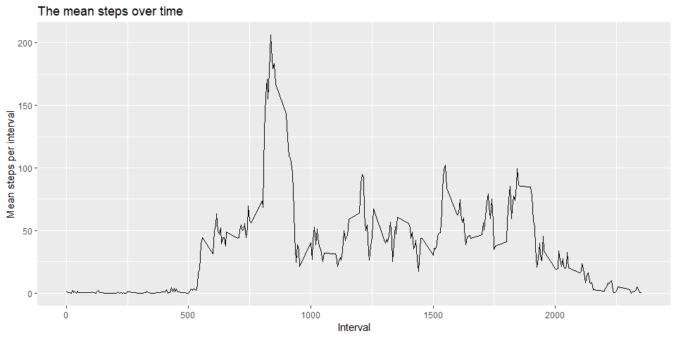

## Loading and preprocessing the data

First we unzip the file with the data.  
_Make sure you have downloaded the zip-file containing the data, "activit.zip". This file is included in the Git repository._

***
1. Unzip the datafile.

```r
unzip("activity.zip")
```

***
2. We now load the data as a data.frame object.

```r
df <- read.csv("activity.csv", header = TRUE)
head(df)
```

```
##   steps       date interval
## 1    NA 2012-10-01        0
## 2    NA 2012-10-01        5
## 3    NA 2012-10-01       10
## 4    NA 2012-10-01       15
## 5    NA 2012-10-01       20
## 6    NA 2012-10-01       25
```

## What is mean total number of steps taken per day?
We want ot compute the mean total numer of steps taken per day.  

***
1. Calculate the total number of steps taken per day.


```r
library(dplyr)
```

```
## 
## Attaching package: 'dplyr'
```

```
## The following objects are masked from 'package:stats':
## 
##     filter, lag
```

```
## The following objects are masked from 'package:base':
## 
##     intersect, setdiff, setequal, union
```

```r
groupedDF <- df %>% group_by(date) %>% summarise(total_per_day = sum(steps, na.rm = TRUE))
```

***
2. Make a histogram of the total number of steps taken each day.


```r
library(ggplot2)
ggplot(data = groupedDF, aes(x = total_per_day)) + 
        geom_histogram(fill = "red", col = "black", bins = 30) +
        labs(x = "Total steps per day", titel = "Histogram of total steps per day")
```

<!-- -->

***
3. Calculate and report the mean and median of the total number of steps taken per day.


```r
mean_steps <- mean(groupedDF$total_per_day)
median_steps <- mean(groupedDF$total_per_day)

print(paste("The mean is ", round(mean_steps,1), ", and the median is ", round(median_steps,1), " steps.", sep = ""))
```

```
## [1] "The mean is 9354.2, and the median is 9354.2 steps."
```


## What is the average daily activity pattern?

***
1. Make a time series plot of the 5-minute interval (x-axis) and the average number of steps taken, averaged across all days (y-axis).


```r
df$interval <- as.factor(df$interval)
groupedDF2 <- df %>% group_by(interval) %>% summarise(mean_per_interval = mean(steps, na.rm = TRUE))
groupedDF2$interval <- as.numeric(as.character(groupedDF2$interval))
ggplot(data = groupedDF2, aes(x = interval, y = mean_per_interval)) + 
        geom_line(aes(x = interval)) +
        labs(x = "Interval", y = "Mean steps per interval", title = "The mean steps over time")
```

<!-- -->

***
2. Which 5-minute interval, on average across all the days in the dataset, contains the maximum number of steps?


```r
indx <- which(groupedDF2$mean_per_interval == max(groupedDF2$mean_per_interval))
print(paste("The interval with the most activity is the ", groupedDF2[indx,]$interval, "th minute interval.", sep = ""))
```

```
## [1] "The interval with the most activity is the 835th minute interval."
```

## Imputing missing values

***
1. Calculate and report the total number of missing values in the dataset.

```r
missing_values <- sum(is.na(df$steps))
print(paste("The total number of missing values is ", missing_values, ".", sep = ""))
```

```
## [1] "The total number of missing values is 2304."
```

***
2. We will use the mean for the particular day to fill in missing values.

```r
df$interval <- as.numeric(as.character(df$interval))
df2 <- df
for(i in 1:nrow(df2)){
        if(is.na(df2[i,]$steps)){
                df2[i,]$steps <- groupedDF2[groupedDF2$interval == df2$interval[i],]$mean_per_interval
        }
}
```

3. Make a histogram of the total number of steps taken each day and Calculate and report the mean and median total number of steps taken per day. Do these values differ from the estimates from the first part of the assignment? What is the impact of imputing missing data on the estimates of the total daily number of steps?


```r
groupedDF3 <- df2 %>% group_by(date) %>% summarise(total_per_day = sum(steps, na.rm = TRUE))

ggplot(data = groupedDF3, aes(x = total_per_day)) + 
        geom_histogram(fill = "red", col = "black", bins = 30) +
        labs(x = "Total steps per day", title = "Histogram of total steps per day")
```

<!-- -->

```r
mean_step_new <- mean(groupedDF3$total_per_day)
median_step_new <- mean(groupedDF3$total_per_day)

print(paste("The new mean is ", round(mean_step_new,1), ", and the new median is ", round(median_step_new,1), ".", sep = ""))
```

```
## [1] "The new mean is 10766.2, and the new median is 10766.2."
```
After filling in the data the mean has shifted with 1412 and the median has shifted with 1412. To measure the impact of filling i the data we will compare the shifts of the means with the standard deviation of the original dataste.


```r
stand_dev <- round(sd(df$steps, na.rm = TRUE),2)

impact_mean <- (mean_step_new-mean_steps)/stand_dev
impact_median <- (median_step_new-median_steps)/stand_dev

print(paste("The mean has shifted with ", round(impact_mean), " standard deviations and the median has shifted with ", round(impact_median), " standard deviations.", sep = ""))
```

```
## [1] "The mean has shifted with 13 standard deviations and the median has shifted with 13 standard deviations."
```

## Are there differences in activity patterns between weekdays and weekends?

1. We wil create a new factor variable in the dataset with two levels - "weekday" and "weekend" indicating whether a given date is a weekday or weekend day (we will ise the new dataset where the missing values are filled in).


```r
df2$date <- as.Date(df$date, format = "%Y-%m-%d")
df2$weekday <- weekdays(df2$date, abbr = TRUE)
df2$weekday <- ifelse(df2$week %in% c("zo", "za"), "weekend", "weekday")
```

2. Finally we will make a panel plot containing a time series plot of the 5-minute interval (x-axis) and the average number of steps taken, averaged across all weekday days or weekend days (y-axis). See the README file in the GitHub repository to see an example of what this plot should look like using simulated data.


```r
groupedDF4 <- df2 %>% group_by(weekday, interval) %>% summarise(mean_per_interval = mean(steps))
ggplot(data = groupedDF4, aes(x = interval, y = mean_per_interval)) + geom_line(col = "red") + 
        facet_grid(vars(weekday)) + labs(x = "Interval", y = "Averga steps", title = "The average steps in each interval in weekdays vs. weekends")
```

<!-- -->


